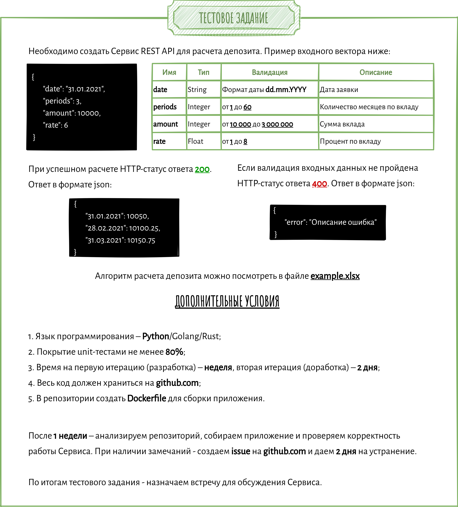

# Тестовое задание

Приложение находится в папке `app`  

Контроллер запросов в файле `__init__.py`

`sketch.ipynb` - наброски которые делал во время работы например разбор и проверка алгоритма расчёта 

## Задание:

